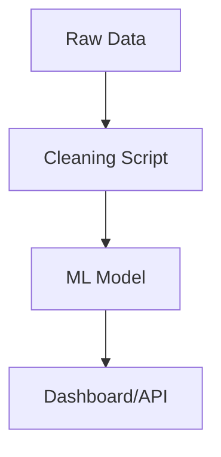

# 📌 Project Title

> A brief one-sentence description of what your project does.

---

## 🧠 Table of Contents

- [About](#about)
- [Features](#features)
- [Tech Stack](#tech-stack)
- [Getting Started](#getting-started)
- [Usage](#usage)
- [API (Optional)](#api)
- [Screenshots (Optional)](#screenshots)
- [Data Pipeline (Optional)](#data-pipeline)
- [Contributing](#contributing)
- [License](#license)
- [Contact](#contact)

---

## 📖 About

Explain what the project is, the problem it solves, and who it's for. Include a short paragraph that would make a stranger understand the *what* and *why* of this project.

Example:
> This project forecasts trail development in parks using machine learning. It helps park managers allocate maintenance resources by predicting where and how long new trails will be built over the next 10 years.

---

## ✨ Features

- ✅ Feature 1
- ✅ Feature 2
- 🚧 Feature 3 (coming soon)

---

## 🛠 Tech Stack

List all technologies used:

- **Frontend:** React / HTML / Tailwind
- **Backend:** FastAPI / Node.js / Flask
- **Database:** PostgreSQL / Supabase / MySQL
- **ML/Analytics:** Python / Pandas / scikit-learn / Matplotlib
- **Hosting:** Vercel / Heroku / Streamlit Cloud

---

## 🚀 Getting Started

Instructions to set up the project locally:

```bash
# 1. Clone the repo
git clone https://github.com/yourusername/project-name.git
cd project-name

# 2. Set up virtual environment (if Python)
python -m venv venv
source venv/bin/activate

# 3. Install dependencies
pip install -r requirements.txt

# 4. Run the app
python main.py
```

If using Docker:

```bash
docker build -t project-name .
docker run -p 8000:8000 project-name
```

---

## 📈 Usage

Explain how users can interact with your project. Screenshots, GIFs, and CLI/API examples go here.

```bash
# Example CLI usage
python forecast.py --years 10
```

Or link to a Streamlit/hosted version if it exists.

---

## 🧪 API (Optional)

If your project exposes an API:

| Method | Endpoint | Description            |
|--------|----------|------------------------|
| GET    | `/trails`| List all trail data    |
| POST   | `/predict` | Predict new trails   |

---

## 🖼 Screenshots (Optional)

Add UI screenshots or CLI outputs here.

---

## 🔁 Data Pipeline (Optional)



Explain your end-to-end flow: where the data comes from, how it is cleaned, transformed, and used.

---

## 🤝 Contributing

Contributions are welcome! To contribute:

1. Fork the repo
2. Create your feature branch (`git checkout -b feature/FeatureName`)
3. Commit your changes (`git commit -m 'Add feature'`)
4. Push to the branch (`git push origin feature/FeatureName`)
5. Open a Pull Request

---

## 📝 License

This project is licensed under the MIT License - see the [LICENSE](LICENSE) file for details.

---

## 📬 Contact

Created by [Your Name](https://github.com/yourusername)  
Reach me via: your.email@example.com  
LinkedIn: [your-link](https://linkedin.com/in/yourprofile)